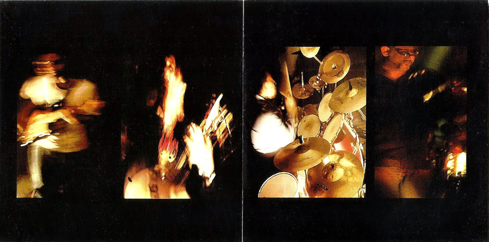

# 🎸 The Watson Brothers

[](https://github.com/GhostDog45/BD-Band-Music) [](#) [](#) [](#)

<p align="center">
  
</p>

## 🌟 About the Band

> **The Watson Brothers** is an influential Bangladeshi alternative rock and post-grunge band formed in Dhaka in 2000. Founded by drummer Khaled Arafat Kazi and guitarist Imran Anowar Aziz (former members of The Attempted Band - TAB), they were joined by powerhouse frontman/vocalist Chowdhury Fazle Shakib and bassist Farhan Samad Hasan (both notable from Cryptic Fate). Emerging during the golden era of Dhaka's underground rock movement, the band captured hearts with their rich grunge textures, melodic emotional weight, and iconic vocal hooks. Their seminal debut album *Ohom* (অহম), featuring the legendary youth anthem *"Akash"* (the theme of GrameenPhone's Djuice campaign), remains one of the most revered cult classics in Bangladeshi rock history.

---

## 📑 Discography Index

1. [Ohom (অহম) (2003)](#1-ohom-2003)
2. [The Third Album (Live & Demos)](#2-the-third-album-live--demos)

---

<a id="1-ohom-2003"></a>
## 1. Ohom (অহম) (2003)

- **Band:** The Watson Brothers
- **Release Year:** 2003
- **Record Label:** G-Series
- **Audio Quality:** Lossless FLAC (16-bit / 44.1 kHz)

<p align="center">
  
</p>

### 📖 About the Album
Released in September 2003 under the label G-Series, *Ohom* ("Ego") is the critically acclaimed debut and landmark studio album by The Watson Brothers. The album became an instant cultural touchstone in the Bangladeshi alternative music circuit. Propelled by the massive nationwide hit *"Akash"* (which soundtracked an entire generation through the GrameenPhone Djuice youth wave), *Ohom* seamlessly weaves driving post-grunge riffs, introspective songwriting, and hauntingly melodic vocals across masterpieces like *"Chaya"*, *"Rong"*, *"Amar Notun Ami"*, and the epic closing track *"...Shore Daray, Shesh Barer Moto"*.

### 🎵 Tracklist (One-Tap Download)

- [**01. Akash**](https://media.githubusercontent.com/media/GhostDog45/The-Watson-Brothers/master/Ohom/01.%20Akash.flac?download=true) &nbsp; [](https://media.githubusercontent.com/media/GhostDog45/The-Watson-Brothers/master/Ohom/01.%20Akash.flac?download=true)
- [**02. Chaya**](https://media.githubusercontent.com/media/GhostDog45/The-Watson-Brothers/master/Ohom/02.%20Chaya.flac?download=true) &nbsp; [](https://media.githubusercontent.com/media/GhostDog45/The-Watson-Brothers/master/Ohom/02.%20Chaya.flac?download=true)
- [**03. Rong**](https://media.githubusercontent.com/media/GhostDog45/The-Watson-Brothers/master/Ohom/03.%20Rong.flac?download=true) &nbsp; [](https://media.githubusercontent.com/media/GhostDog45/The-Watson-Brothers/master/Ohom/03.%20Rong.flac?download=true)
- [**04. Amar Notun Ami**](https://media.githubusercontent.com/media/GhostDog45/The-Watson-Brothers/master/Ohom/04.%20Amar%20Notun%20Ami.flac?download=true) &nbsp; [](https://media.githubusercontent.com/media/GhostDog45/The-Watson-Brothers/master/Ohom/04.%20Amar%20Notun%20Ami.flac?download=true)
- [**05. Ohom**](https://media.githubusercontent.com/media/GhostDog45/The-Watson-Brothers/master/Ohom/05.%20Ohom.flac?download=true) &nbsp; [](https://media.githubusercontent.com/media/GhostDog45/The-Watson-Brothers/master/Ohom/05.%20Ohom.flac?download=true)
- [**06. Shongket**](https://media.githubusercontent.com/media/GhostDog45/The-Watson-Brothers/master/Ohom/06.%20Shongket.flac?download=true) &nbsp; [](https://media.githubusercontent.com/media/GhostDog45/The-Watson-Brothers/master/Ohom/06.%20Shongket.flac?download=true)
- [**07. Jhor**](https://media.githubusercontent.com/media/GhostDog45/The-Watson-Brothers/master/Ohom/07.%20Jhor.flac?download=true) &nbsp; [](https://media.githubusercontent.com/media/GhostDog45/The-Watson-Brothers/master/Ohom/07.%20Jhor.flac?download=true)
- [**08. Prachir**](https://media.githubusercontent.com/media/GhostDog45/The-Watson-Brothers/master/Ohom/08.%20Prachir.flac?download=true) &nbsp; [](https://media.githubusercontent.com/media/GhostDog45/The-Watson-Brothers/master/Ohom/08.%20Prachir.flac?download=true)
- [**09. Shanti**](https://media.githubusercontent.com/media/GhostDog45/The-Watson-Brothers/master/Ohom/09.%20Shanti.flac?download=true) &nbsp; [](https://media.githubusercontent.com/media/GhostDog45/The-Watson-Brothers/master/Ohom/09.%20Shanti.flac?download=true)
- [**10. ...Shore Daray, Shesh Barer Moto**](https://media.githubusercontent.com/media/GhostDog45/The-Watson-Brothers/master/Ohom/10.%20...Shore%20Daray%2C%20Shesh%20Barer%20Moto.flac?download=true) &nbsp; [](https://media.githubusercontent.com/media/GhostDog45/The-Watson-Brothers/master/Ohom/10.%20...Shore%20Daray%2C%20Shesh%20Barer%20Moto.flac?download=true)

### 🖼️ Album Artwork

| | |
| :---: | :---: |
| <br><sub><b>1. Front Cover</b></sub> | <br><sub><b>2. Booklet (Part 1)</b></sub> |
| <br><sub><b>3. Booklet (Part 2)</b></sub> | <br><sub><b>4. Inset (Front)</b></sub> |
| <br><sub><b>5. Compact Disc (CD)</b></sub> | <br><sub><b>6. Back Inset</b></sub> |
| <br><sub><b>7. Back Cover</b></sub> |  |

---

---

<a id="2-the-third-album-live--demos"></a>
## 2. The Third Album (Live & Demos)

- **Band:** The Watson Brothers
- **Audio Quality:** Lossless FLAC (16-bit / 44.1 kHz)

### 📖 About the Album
*The Third Album* represents a treasured archival collection of unreleased studio demos from 2000 alongside raw, electrifying live concert performances recorded at the All Community Club (June 29, 2005) and historic rehearsal sessions. This compilation preserves the band's earliest grunge prototypes like *"Spiral Self"*, *"The Horizontal Neck"*, and *"Fears Realized"*, as well as energetic live renditions of classics like *"Akash"*, *"Amar Notun Ami"*, and *"Ohom"*.

### 🎵 Tracklist (One-Tap Download)

- [**The Watson Brothers - Akash - live at All Community Club, 29 June 2005**](https://media.githubusercontent.com/media/GhostDog45/The-Watson-Brothers/master/The%20Third%20Album/The%20Watson%20Brothers%20-%20Akash%20-%20live%20at%20All%20Community%20Club%2C%2029%20June%202005.flac?download=true) &nbsp; [](https://media.githubusercontent.com/media/GhostDog45/The-Watson-Brothers/master/The%20Third%20Album/The%20Watson%20Brothers%20-%20Akash%20-%20live%20at%20All%20Community%20Club%2C%2029%20June%202005.flac?download=true)
- [**The Watson Brothers - Amar Notun Ami - live at All Community Club, 29 June 2005**](https://media.githubusercontent.com/media/GhostDog45/The-Watson-Brothers/master/The%20Third%20Album/The%20Watson%20Brothers%20-%20Amar%20Notun%20Ami%20-%20live%20at%20All%20Community%20Club%2C%2029%20June%202005.flac?download=true) &nbsp; [](https://media.githubusercontent.com/media/GhostDog45/The-Watson-Brothers/master/The%20Third%20Album/The%20Watson%20Brothers%20-%20Amar%20Notun%20Ami%20-%20live%20at%20All%20Community%20Club%2C%2029%20June%202005.flac?download=true)
- [**The Watson Brothers - Cchaya - live at All Community Club, 29 June 2005**](https://media.githubusercontent.com/media/GhostDog45/The-Watson-Brothers/master/The%20Third%20Album/The%20Watson%20Brothers%20-%20Cchaya%20-%20live%20at%20All%20Community%20Club%2C%2029%20June%202005.flac?download=true) &nbsp; [](https://media.githubusercontent.com/media/GhostDog45/The-Watson-Brothers/master/The%20Third%20Album/The%20Watson%20Brothers%20-%20Cchaya%20-%20live%20at%20All%20Community%20Club%2C%2029%20June%202005.flac?download=true)
- [**The Watson Brothers - Fears Realized - original 2000 demo**](https://media.githubusercontent.com/media/GhostDog45/The-Watson-Brothers/master/The%20Third%20Album/The%20Watson%20Brothers%20-%20Fears%20Realized%20-%20original%202000%20demo.flac?download=true) &nbsp; [](https://media.githubusercontent.com/media/GhostDog45/The-Watson-Brothers/master/The%20Third%20Album/The%20Watson%20Brothers%20-%20Fears%20Realized%20-%20original%202000%20demo.flac?download=true)
- [**The Watson Brothers - My Dreams Kiss - original 2000 demo**](https://media.githubusercontent.com/media/GhostDog45/The-Watson-Brothers/master/The%20Third%20Album/The%20Watson%20Brothers%20-%20My%20Dreams%20Kiss%20-%20original%202000%20demo.flac?download=true) &nbsp; [](https://media.githubusercontent.com/media/GhostDog45/The-Watson-Brothers/master/The%20Third%20Album/The%20Watson%20Brothers%20-%20My%20Dreams%20Kiss%20-%20original%202000%20demo.flac?download=true)
- [**The Watson Brothers - Ohom - live at All Community Club, 29 June 2005**](https://media.githubusercontent.com/media/GhostDog45/The-Watson-Brothers/master/The%20Third%20Album/The%20Watson%20Brothers%20-%20Ohom%20-%20live%20at%20All%20Community%20Club%2C%2029%20June%202005.flac?download=true) &nbsp; [](https://media.githubusercontent.com/media/GhostDog45/The-Watson-Brothers/master/The%20Third%20Album/The%20Watson%20Brothers%20-%20Ohom%20-%20live%20at%20All%20Community%20Club%2C%2029%20June%202005.flac?download=true)
- [**The Watson Brothers - Playing with Myself--Theodore Witherspoon's Moment of Glory - original 2000 demo**](https://media.githubusercontent.com/media/GhostDog45/The-Watson-Brothers/master/The%20Third%20Album/The%20Watson%20Brothers%20-%20Playing%20with%20Myself--Theodore%20Witherspoon%27s%20Moment%20of%20Glory%20-%20original%202000%20demo.flac?download=true) &nbsp; [](https://media.githubusercontent.com/media/GhostDog45/The-Watson-Brothers/master/The%20Third%20Album/The%20Watson%20Brothers%20-%20Playing%20with%20Myself--Theodore%20Witherspoon%27s%20Moment%20of%20Glory%20-%20original%202000%20demo.flac?download=true)
- [**The Watson Brothers - Rong - live at All Community Club, 29 June 2005**](https://media.githubusercontent.com/media/GhostDog45/The-Watson-Brothers/master/The%20Third%20Album/The%20Watson%20Brothers%20-%20Rong%20-%20live%20at%20All%20Community%20Club%2C%2029%20June%202005.flac?download=true) &nbsp; [](https://media.githubusercontent.com/media/GhostDog45/The-Watson-Brothers/master/The%20Third%20Album/The%20Watson%20Brothers%20-%20Rong%20-%20live%20at%20All%20Community%20Club%2C%2029%20June%202005.flac?download=true)
- [**The Watson Brothers - Rong - rehearsal at Sarfaraz Bhai's, 24 June 2005**](https://media.githubusercontent.com/media/GhostDog45/The-Watson-Brothers/master/The%20Third%20Album/The%20Watson%20Brothers%20-%20Rong%20-%20rehearsal%20at%20Sarfaraz%20Bhai%27s%2C%2024%20June%202005.flac?download=true) &nbsp; [](https://media.githubusercontent.com/media/GhostDog45/The-Watson-Brothers/master/The%20Third%20Album/The%20Watson%20Brothers%20-%20Rong%20-%20rehearsal%20at%20Sarfaraz%20Bhai%27s%2C%2024%20June%202005.flac?download=true)
- [**The Watson Brothers - Spiral Self - original 2000 demo**](https://media.githubusercontent.com/media/GhostDog45/The-Watson-Brothers/master/The%20Third%20Album/The%20Watson%20Brothers%20-%20Spiral%20Self%20-%20original%202000%20demo.flac?download=true) &nbsp; [](https://media.githubusercontent.com/media/GhostDog45/The-Watson-Brothers/master/The%20Third%20Album/The%20Watson%20Brothers%20-%20Spiral%20Self%20-%20original%202000%20demo.flac?download=true)
- [**The Watson Brothers - The Horizontal Neck - original 2000 demo**](https://media.githubusercontent.com/media/GhostDog45/The-Watson-Brothers/master/The%20Third%20Album/The%20Watson%20Brothers%20-%20The%20Horizontal%20Neck%20-%20original%202000%20demo.flac?download=true) &nbsp; [](https://media.githubusercontent.com/media/GhostDog45/The-Watson-Brothers/master/The%20Third%20Album/The%20Watson%20Brothers%20-%20The%20Horizontal%20Neck%20-%20original%202000%20demo.flac?download=true)

---

### 💾 Git LFS & Downloading Audio
All audio tracks in this repository are managed via **Git LFS** (Large File Storage).
- **One-Tap Direct Download:** Click either the track title or the green `Download FLAC` button next to any song to instantly save the lossless FLAC file to your device.
- **To clone the complete discography locally with all FLAC files:**
  ```bash
  git lfs install
  git clone https://github.com/GhostDog45/The-Watson-Brothers.git
  ```
---

### 🙏 Special Thanks & Gratitude
Heartfelt gratitude to **Shohail Ibne Mahbub (XTR)** for his monumental passion and dedication in keeping Bangladeshi band music alive. Through his archival project [**Bangla CD Covers**](https://banglacdcovers.blogspot.com/), he has painstakingly collected, preserved, and scanned original physical CDs and cassette tapes, ensuring that the legacy, artwork, and history of Bangladesh's rock and band movement remain preserved for generations of music lovers.
